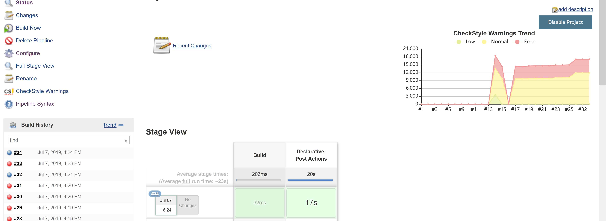
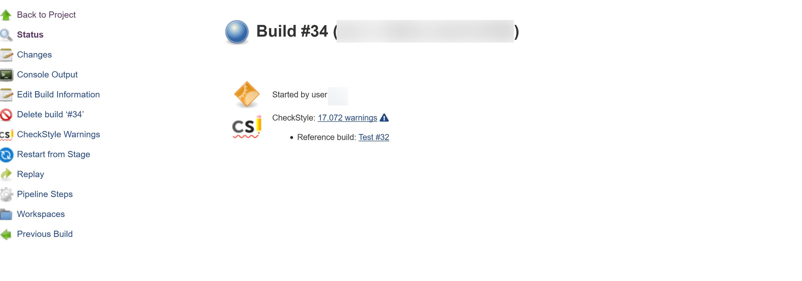
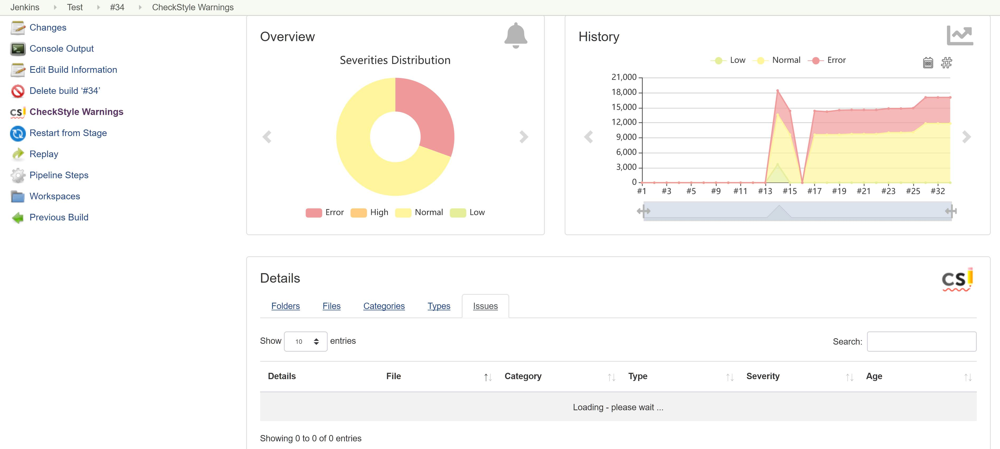
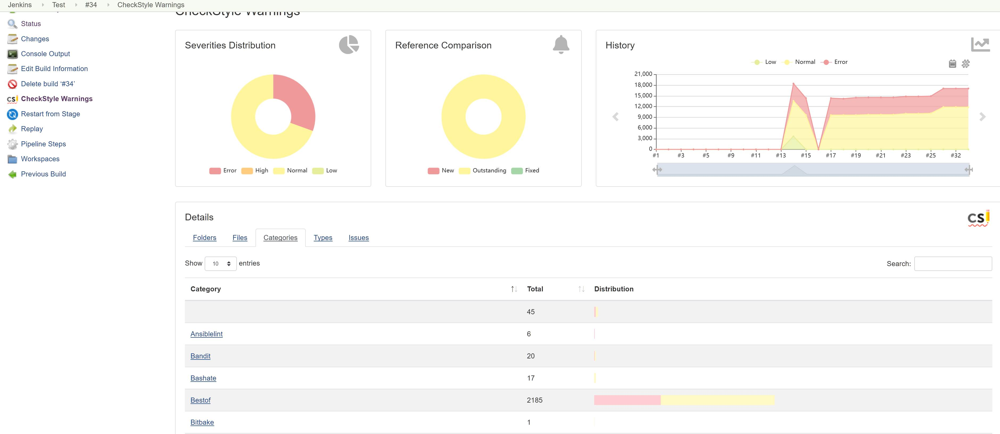
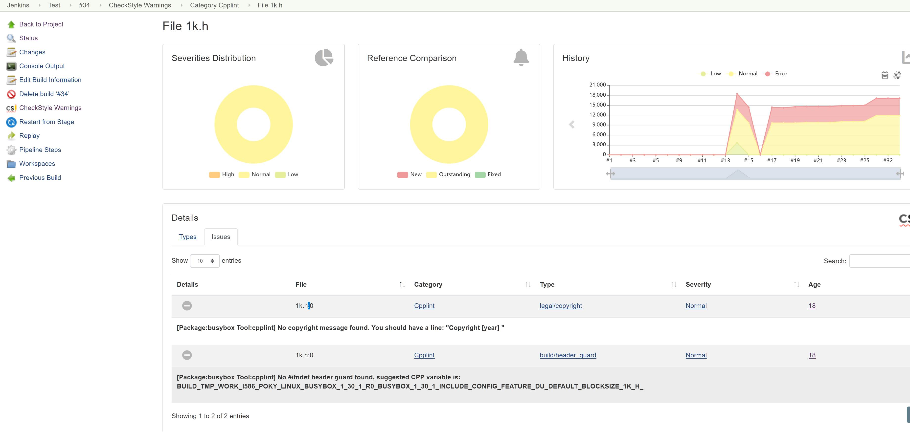

# Basic integration of SCA into jenkins

This document describes the integration of SCA into jenkins

## Prerequisites

* Jenkins
* [Warning Next Generation Plugin](https://plugins.jenkins.io/warnings-ng)

## Using pipeline

In a pipeline simply insert the following

```groovy
post {
    always {
        recordIssues aggregatingResults: true, tools: [checkStyle pattern: "**/checkstyle/*.xml")]
    }
}
```

to reduce the lookup time for files you could also do

```groovy
def deployDir = "$WORKSPACE/tmp/deploy/images/**";

post {
    always {
        recordIssues aggregatingResults: true, tools: [checkStyle pattern: "$deployDir/sca/checkstyle/*.xml")]
    }
}
```

## Results

At the project view in jenkins a run would look like this



At the particular build it would look like this



If you now click on 'CheckStyle Warnings' the following is shown



If you now click on the tab 'Categories' you will see all the results from your enabled tools, with their findings



Now you can browse through the findings (and expand the section)
to view the notice given by the particular tool



## Full example of pipeline

```groovy
/* Alter this path if needed */
def deployDir = "$WORKSPACE/tmp/deploy/images/**";

pipeline {
    agent any
    stages {
        stage('Build') {
            steps {
                echo "Replace this by the build command you are using!"
            }
        }
    }
    post {
       always {
            recordIssues aggregatingResults: true, tools: [checkStyle(pattern: "$deployDir/sca/checkstyle/*.xml")]
       }
    }
}
```
